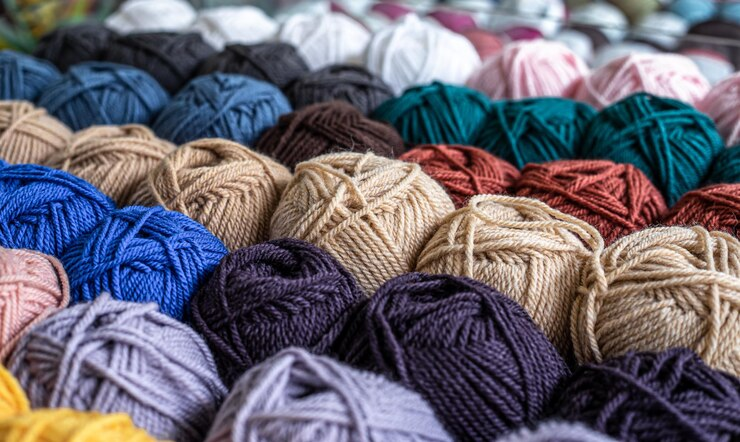

<html lang="es">
<head>
    <meta charset="UTF-8">
    <meta http-equiv="X-UA-Compatible" content="IE=edge">
    <meta name="viewport" content="width=device-width, initial-scale=1.0"/>
<cuerpo>

    <nav class="navbar navbar-expand-lg navbar-light bg-light">
        

          <a class="navbar-brand" href="Inicio.html">Inicio</a>
          <button class="navbar-toggler" type="button" data-bs-toggle="collapse" data-bs-target="#navbarNav" aria-controls="navbarNav" aria-expanded="false" aria-label="Toggle navigation">
            
          </button>
          

            <ul class="navbar-nav">
              <li class="nav-item">
                <a class="nav-link " aria-current="page" href="Nosotros.html">Nosotros</a>
              </li>
              <li class="nav-item">
                <a class="nav-link" href="Galeria.html">Galeria</a>
              </li>
              <li class="nav-item">
                <a class="nav-link" href="Comunicate.html">Comunicate</a>
              </li>
              <li class="nav-item">
                <a class="nav-link" href="Contacto.html">Contacto</a>
              </li>
            </ul>
          

        

      </nav>
      <header class="row aling-items-center header-main justify-content-center">
  

    
Feriantes, un local feriante tipico de la cultura uruguaya. Personas merodeando entre las calles de un sitio observando los diferentes stands de todo lo que puedas imaginar, despertando el interes instantaneo, pues la feria.
  es un lugar unico bajo el cielo azul de un domingo a la mañana, mate bajo el brazo y pasos lentos.
  El aroma inconfundible de comidas a la parrilla, pastas entre otras rapidas salidas para el medio dia de un dia 
  donde lo tipico es no cocinar. 
  Se escucha sin entender palabras pero en un ambiente acogedor de multitudes que se 
  acercan alli solo de paso, a buscar algo en concreto mas economico y de los vendedores que atraen a sus potenciales
  clientes, la feria dominguera. 
  Repuestos de segunda mano, lamparas de años o decadas pasadas, aun en excelente estado, ropas de segunda mano en 
  estado como nuevas, el arte en maderas para el hogar, el arte en lanas, arte de todo tipo y en todos colores que solo 
  encontraras en un sitio feriante, todo creado con manos que se ingenian para salir adelante y mostrar destresa a figuras
  mas comunes, mas hogareñas, mas para ti y tu hogar. 
  La feria ese rincon en calles donde los domingos son un paseo obligatorio, una tradicion, donde esta todo lo que necesites
  y mas, donde una tradicion uruguaya se complementa con lo simples. 

</header>
</cuerpo>
<cuerpo>
 <header class="row aling-items-center header-main justify-content-center">
            
 

    <h1 > Nosotros a que nos dedicamos... </h1>

    
 Somos una pareja de personas mayores que nos dedicamos a producir en
        diferentes formas, arte, arte en madera para decoracion de
        hogar,barbacoas, trabajos de soporte de computadoras, cajones y entre
        muchas cosas para regalar o para ti. Trabajamos en lana y tejido para
        formar zapatatitos para los recien nacidos o bebes con meses de
        nacimiento. Zapatillas para yoga, boinas y gorros para el frio.
        Corta viento o  "chorizo" para colocar sobre la puerta tanto interior como
        exterior contra el invierno, como tambien para las alimañas de puertas
        ingresando a nuestro hogar.
        Decoracion en frascos para tu cocina, para lo que quieras utilizar en tu
        hogar.
        Somos una pequeña empresa, creada para ofrecer un servicio artistico a
        nuestros clientes y tambien para ofrecernos una mejora de calidad de
        salud.
        Tenemos variedad y diferentes enfoques para una eleccion mas bonita
        para ti. 

        </header>
</cuerpo>
</body>
</html>

<html lang="es">
<head>
    <meta charset="UTF-8">
    <meta http-equiv="X-UA-Compatible" content="IE=edge">
    <meta name="viewport" content="width=device-width, initial-scale=1.0"/>
    <link rel="icon" type="image/jpg" href="./image/logo.jpg"/>
     <!--SEO-->
     <meta name="description" content="Tu feria online,arte en maderas,cuerinas,lanas,articulos varios, whatsapp - instagram - facebook"/>
     <meta name="keywords" content="ARTE EN MADERA,CUERINA, LANAS, ARTE PARA HOGAR, DECORACION">
     <!-- Boostrap -->
    <link href="https://cdn.jsdelivr.net/npm/bootstrap@5.1.3/dist/css/bootstrap.min.css" rel="stylesheet" integrity="sha384-1BmE4kWBq78iYhFldvKuhfTAU6auU8tT94WrHftjDbrCEXSU1oBoqyl2QvZ6jIW3" crossorigin="anonymous">
    <link rel="stylesheet" href="css/estilos.css"/>
    <title>kickstreets-Creo&Pinto</title>
    
</head>
<body>
<body>
<header class="row aling-items-center header-main justify-content-center">
  

<h1>Nuestros productos </h1>

    

	
	
  <!--responsive boostrap imagenes-->
     <section>
      

     

      
      

        <h5 class="card-title">soporte para celular</h5>
        
Soporte moderno y super util para celular

        

    

      
    

      
      

        <h5 class="card-title">Soporte para Notebook</h5>
        
Soporte moderno y super manejable para Notbook de todas las medidas

        

    

     

      
      

        <h5 class="card-title">Soporte ropa/sombreros</h5>
        
diferentes diseños y maneras de soportes para ropa,sombreros, etc. 

        
      

    

      

      

    

      
      

        <h5 class="card-title">Reciclando en casa</h5>
        
Reciclaje de frascos para un nuevo uso 

         

    

    

      
      

        <h5 class="card-title">Frascos decorados</h5>
        
Decoracion simples para tu hogar, souvenir

       

    

    

      
      

        <h5 class="card-title">Souvenir</h5>
        
Souvenir para cumpleaños

         

    

      

      

    

      
      

        <h5 class="card-title">Abridores de botellas</h5>
        
Abridores rusticos para botellas

        
      

    

    

      
      

        <h5 class="card-title">Casillero de botellas</h5>
        
Casillero rustico para botellas de vidrio

        
      

    

      
      
    

      
      

        <h5 class="card-title">Corta vientos</h5>
        
Corta vientos y insectos  o "chorizos"

       
      

    

  

  

    

      
      

        <h5 class="card-title">Zapatos para bebes</h5>
        
Zapatos para bebes en lana

     
      

    

    

      
      

        <h5 class="card-title">Trabajos en lana</h5>
        
hacemos tu pedido en lanas 

     
      

    

    

      
      

        <h5 class="card-title">Zapatos yoga adultos en lana</h5>
        
Zapatos en lana para adultos

        
      

    

  

</section>
</header>
  

 
</body>
</html>

<html lang="es">
<head>
    <meta charset="UTF-8">
    <meta http-equiv="X-UA-Compatible" content="IE=edge">
    <meta name="viewport" content="width=device-width, initial-scale=1.0"/>
    <link rel="icon" type="image/jpg" href="./image/logo.jpg"/>
     <!--SEO-->
     <meta name="description" content="Tu feria online,arte en maderas,cuerinas,lanas,articulos varios, whatsapp - instagram - facebook"/>
     <meta name="keywords" content="ARTE EN MADERA,CUERINA, LANAS, ARTE PARA HOGAR, DECORACION">
     <!-- Boostrap -->
    <link href="https://cdn.jsdelivr.net/npm/bootstrap@5.1.3/dist/css/bootstrap.min.css" rel="stylesheet" integrity="sha384-1BmE4kWBq78iYhFldvKuhfTAU6auU8tT94WrHftjDbrCEXSU1oBoqyl2QvZ6jIW3" crossorigin="anonymous">
    <link rel="stylesheet" href="css/estilos.css"/>
    <title>kickstreets-Creo&Pinto</title>
</head>
<body> 
<header class="row aling-items-center header-main justify-content-center">
  

  <section>

        <h1> Comunicate con nosotros y solicita tu pedido</h1> 

    </form-->
    <!--boostrap en fieldset-->
    <form class="row gy-2 gx-3 align-items-center">
        

          <label class="visually-hidden" for="autoSizingInput">Name</label>
          <input type="text" class="form-control" id="autoSizingInput" placeholder="Nombre">
        

        

          <label class="visually-hidden" for="autoSizingInputGroup">Email</label>
          

            
@

            <input type="text" class="form-control" id="autoSizingInputGroup" placeholder="Email">
          

        

        

          <label class="visually-hidden" for="autoSizingSelect">email</label>
        
        

        

          

            <input class="form-check-input" type="checkbox" id="autoSizingCheck">
            <label class="label" class="form-check-label" for="autoSizingCheck">
              Recordarme
            </label>
          

        

        

            <textarea rows="10" cols="30" placeholder="Dejanos tu pedido"></textarea> 
             
             
            <label class="label">Envianos y nos comunicamos con usted.</label> 

          <button type="submit" class="btn btn-primary">Enviar</button>
        

      </form>
    </section>
    </header>
    
      </aside>

     
</body>
</html>
<html lang="es">
<head>
    <meta charset="UTF-8">
    <meta http-equiv="X-UA-Compatible" content="IE=edge">
    <meta name="viewport" content="width=device-width, initial-scale=1.0"/>
    <link rel="icon" type="image/jpg" href="./image/logo.jpg"/> 
     <!--SEO-->
     <meta name="description" content="Tu feria online,arte en maderas,cuerinas,lanas,articulos varios, whatsapp - instagram - facebook"/>
     <meta name="keywords" content="ARTE EN MADERA,CUERINA, LANAS, ARTE PARA HOGAR, DECORACION">
     <!-- Boostrap -->
    <link href="https://cdn.jsdelivr.net/npm/bootstrap@5.1.3/dist/css/bootstrap.min.css" rel="stylesheet" integrity="sha384-1BmE4kWBq78iYhFldvKuhfTAU6auU8tT94WrHftjDbrCEXSU1oBoqyl2QvZ6jIW3" crossorigin="anonymous">
    <link rel="stylesheet" href="css/estilos.css"/>
    <title>kickstreets-Creo&Pinto</title>
</head>
<body>
<header class="row aling-items-center header-main justify-content-center">
      
 

       <h1> Donde nos encontras </h1>

       
 
       Estamos en la ciudad de Paysandu en Uruguay. Tenemos diferentes medios de comunicacion
        como tambien para ver nuestros trabajos. Participamos los dias domingo por la mañana
        en la feria de dicha ciudad por calle Soriano.
           
         
        Por la tarde el mismo dia estamos en otro sector feriante de la ciudad esta vez en la 
        zona del parque costanero, sobre la avenida de entrada del Anfiteatro del Rio Uruguay.  
        Tenemos contacto por redes sociales tanto como es Instagram y Facebook. 
        Te dejamos nuestro Whatsapp donde podes comunicarte mas directamente.

        Somos Creacion y creatividad en arte de madera,cuerina,souvenir,lana,entre otros. 
        Esperamos tu visita. 
       

	   

  

    

 
     
    
      <a href="https://api.whatsapp.com/send?phone=03398507056">
      <svg xmlns="https://api.whatsapp.com/send?phone=03398507056"  width="40" height="40" fill="green" class="bi bi-whatsapp" viewBox="0 0 16 16">
        <path  d="M13.601 2.326A7.854 7.854 0 0 0 7.994 0C3.627 0 .068 3.558.064 7.926c0 1.399.366 2.76 1.057 3.965L0 16l4.204-1.102a7.933 7.933 0 0 0 3.79.965h.004c4.368 0 7.926-3.558 7.93-7.93A7.898 7.898 0 0 0 13.6 2.326zM7.994 14.521a6.573 6.573 0 0 1-3.356-.92l-.24-.144-2.494.654.666-2.433-.156-.251a6.56 6.56 0 0 1-1.007-3.505c0-3.626 2.957-6.584 6.591-6.584a6.56 6.56 0 0 1 4.66 1.931 6.557 6.557 0 0 1 1.928 4.66c-.004 3.639-2.961 6.592-6.592 6.592zm3.615-4.934c-.197-.099-1.17-.578-1.353-.646-.182-.065-.315-.099-.445.099-.133.197-.513.646-.627.775-.114.133-.232.148-.43.05-.197-.1-.836-.308-1.592-.985-.59-.525-.985-1.175-1.103-1.372-.114-.198-.011-.304.088-.403.087-.088.197-.232.296-.346.1-.114.133-.198.198-.33.065-.134.034-.248-.015-.347-.05-.099-.445-1.076-.612-1.47-.16-.389-.323-.335-.445-.34-.114-.007-.247-.007-.38-.007a.729.729 0 0 0-.529.247c-.182.198-.691.677-.691 1.654 0 .977.71 1.916.81 2.049.098.133 1.394 2.132 3.383 2.992.47.205.84.326 1.129.418.475.152.904.129 1.246.08.38-.058 1.171-.48 1.338-.943.164-.464.164-.86.114-.943-.049-.084-.182-.133-.38-.232z"/>
      </svg>
      </a>
       
       
      <a href="https://www.instagram.com/">
      <svg xmlns="https://www.instagram.com/"    width="40" height="40" fill="black" class="bi bi-instagram" viewBox="0 0 16 16">
        <path d="M8 0C5.829 0 5.556.01 4.703.048 3.85.088 3.269.222 2.76.42a3.917 3.917 0 0 0-1.417.923A3.927 3.927 0 0 0 .42 2.76C.222 3.268.087 3.85.048 4.7.01 5.555 0 5.827 0 8.001c0 2.172.01 2.444.048 3.297.04.852.174 1.433.372 1.942.205.526.478.972.923 1.417.444.445.89.719 1.416.923.51.198 1.09.333 1.942.372C5.555 15.99 5.827 16 8 16s2.444-.01 3.298-.048c.851-.04 1.434-.174 1.943-.372a3.916 3.916 0 0 0 1.416-.923c.445-.445.718-.891.923-1.417.197-.509.332-1.09.372-1.942C15.99 10.445 16 10.173 16 8s-.01-2.445-.048-3.299c-.04-.851-.175-1.433-.372-1.941a3.926 3.926 0 0 0-.923-1.417A3.911 3.911 0 0 0 13.24.42c-.51-.198-1.092-.333-1.943-.372C10.443.01 10.172 0 7.998 0h.003zm-.717 1.442h.718c2.136 0 2.389.007 3.232.046.78.035 1.204.166 1.486.275.373.145.64.319.92.599.28.28.453.546.598.92.11.281.24.705.275 1.485.039.843.047 1.096.047 3.231s-.008 2.389-.047 3.232c-.035.78-.166 1.203-.275 1.485a2.47 2.47 0 0 1-.599.919c-.28.28-.546.453-.92.598-.28.11-.704.24-1.485.276-.843.038-1.096.047-3.232.047s-2.39-.009-3.233-.047c-.78-.036-1.203-.166-1.485-.276a2.478 2.478 0 0 1-.92-.598 2.48 2.48 0 0 1-.6-.92c-.109-.281-.24-.705-.275-1.485-.038-.843-.046-1.096-.046-3.233 0-2.136.008-2.388.046-3.231.036-.78.166-1.204.276-1.486.145-.373.319-.64.599-.92.28-.28.546-.453.92-.598.282-.11.705-.24 1.485-.276.738-.034 1.024-.044 2.515-.045v.002zm4.988 1.328a.96.96 0 1 0 0 1.92.96.96 0 0 0 0-1.92zm-4.27 1.122a4.109 4.109 0 1 0 0 8.217 4.109 4.109 0 0 0 0-8.217zm0 1.441a2.667 2.667 0 1 1 0 5.334 2.667 2.667 0 0 1 0-5.334z"/>
      </svg>
      </a>
       
       
      <a href="https://es-la.facebook.com/">
      <svg xmlns=" https://es-la.facebook.com/" width="40" height="40" fill="blue" class="bi bi-facebook" viewBox="0 0 16 16">
        <path d="M16 8.049c0-4.446-3.582-8.05-8-8.05C3.58 0-.002 3.603-.002 8.05c0 4.017 2.926 7.347 6.75 7.951v-5.625h-2.03V8.05H6.75V6.275c0-2.017 1.195-3.131 3.022-3.131.876 0 1.791.157 1.791.157v1.98h-1.009c-.993 0-1.303.621-1.303 1.258v1.51h2.218l-.354 2.326H9.25V16c3.824-.604 6.75-3.934 6.75-7.951z"/>
      </svg>
      </a>
      

    
  

  

    <h5 class="card-title"></h5>
    
Creo & Pinto  ©  Paysandu-Uruguay

    
    
  

    

   

</header>
</body>
</html>

@import url('https://fonts.googleapis.com/css2? family= Anek+Latin & family= Fascinate & family= Oswald:wght@700 & display=swap');

body {
    background-color: rgb;
    text-align:center;
    justify-content: center;
    margin: top;
    padding: 0;
    position: 50px;
    font-size: 2rem;
}

/* Sass */ 

$estilos: (
    negro: black,
    gris: gray,
    rojo: red,
    blanco: white,
);
 
html {
    font-size: 15px;
    height: 100%;
}
.header-main{
    height: 100vh;
}

.nav-link {
    padding:50px 10px ;
    display: inline-block;
    margin-top: auto;
    align-items:initial;
    justify-content: center;
    text-decoration: none;
    color: rgb(14, 13, 13);
    cursor: pointer;
    letter-spacing: 7px;
    font-size: medium;
  
}
/* anidado con Scss */
/*extend*/
.flex-container { 
    display: flex;
    justify-content:center;
    align-items: center;
    position:initial; 
    letter-spacing: 5px;
 div{   
        @extend .flex-container;
        flex-basis: 100%;
        margin: 5px;
        height: 10px;
        background: none;
 }
}
 
/* Galeria */
.col-sm-4{
    display:flex;
    background: url(4,2fr );
   
    background-color: white;
    left: 30%;
}
.d-inline-flex{

 display: flex;
 justify-items: center;
grid-template-columns: repeat(1, 3fr);
grid-template-rows: repeat(4, 1fr);
}

/*mixing*/
@mixin img-size($height,$width) {
    height: $height;
    width: $width;
   
    
}

.container {
    @include img-size(400px,200px);
    background: none;
    display: inline-block;
    justify-items: left;
    grid-template-columns: repeat(auto-fill, minmax(100px,1fr));
    grid-template-rows: minmax(auto-fill,auto);
    gap: 20px;
    min-height: 576px;
    padding: 10px;
    align-items:center;
}

/* comunicate */ 

iframe{
    display: flex;
    justify-content: center;
    margin-top:  15%;
    width: 70%;
    left: 70%;
    margin-left: 15%;
}

h1{ 
    display: grid;
    background-color: map-get($estilos, rgb);
    background-position: center;
    flex-direction: row;
    justify-content: center;
    font-family:'Trebuchet MS', 'Lucida Sans Unicode', 'Lucida Grande', 'Lucida Sans', Arial, sans-serif;
    font-size: 3rem;
    color:rgb(247, 244, 244);
    letter-spacing: 5px;
    margin:10%; 
    min-height: 576px;
    align-items:center;
  
    
}

fieldset{
    font-family: oswald;
    background-color: map-get($estilos, black );
    background-position: 25%;
    color: rgb(241, 239, 239);
    font-size: 35px;
    width: 70%;
    left: 50%;
    margin-left: 8%;
    text-align: center;
    margin-top: 30%;
    }
    

.p {
    display: flex;
    background: map-get($estilos,black)(8, 8, 8);
    background-position: center;
    flex-direction: row;
    width: 70%;
    left: 50%;
    margin-left: 8%;
    justify-content: center;
    align-items: center;
    font-family: oswald;
    color: rgba(223, 191, 191, 0.993);
    letter-spacing: 5px;
    font-size: 22px;
    text-align:center;
    padding: 50px 100px;
}
/*redes sociales*/
.bi-whatsapp{
    position: inline-block;
    width:55px;
    height:55px;
    line-height: 55px;
    bottom: 30px;
    right: 30px;
    background: #0df053;
    color: #fff;
    border-radius: 50px;
    text-align: center;
    font-size: 30px;
    
    z-index: 100;
}
.bi-instagram{
    position: inline-block;
    width:55px;
    height:55px;
    line-height: 55px;
    bottom: 30px;
    right: 30px;
    font-size: 30px;
    z-index: 100;
}
.bi-facebook{
    position: inline-block;
    width:55px;
    height:55px;
    line-height: 55px;
    bottom: 30px;
    right: 30px;
    font-size: 30px;
    z-index: 100;

}

    
.logo {
    height: auto;
    width: 800px;
    margin: 20%;
    display: inline;
    background-position: 25%;
    

}

/**media querie**/
@media only screen and (max-widht: 576px){
    body {
        flex-direction: column;
        margin-top: 4rem;
      
    }
    .header-main{
            height: initial;
        }
    }
 
    
    h1{
        flex-direction: column;
        text-align: center;
        width: 100%;   
    }
    .d-inline-flex  {
      flex-direction: column;
      grid-template-columns: repeat(1, 2fr);
      grid-template-rows: repeat(4, 2fr);

    }

    .card{
        
        display: table-column-group;
        flex-direction: column;
        grid-template-columns: repeat( 1, 2fr);
        grid-template-rows: repeat(4,2fr);
       
        
        }

    
